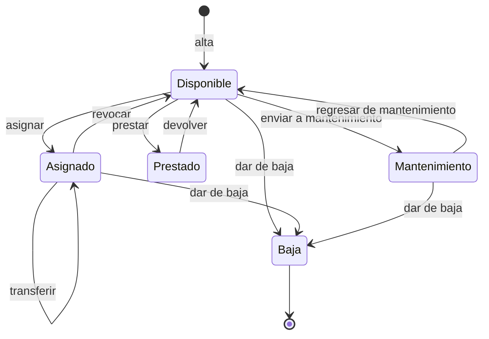

# 01 — SRS · Especificación de Requisitos de Software

| Campo | Valor |
|---|---|
| Documento | 01 — SRS (ISO/IEC/IEEE 29148:2018) |
| Proyecto | SiRe — Sistema de Resguardos OSC |
| Versión | 1.0 |
| Fecha | 2026-07-17 |
| Depende de | [00_auditoria_fuentes](../00-fuentes/00_auditoria_fuentes.md), [ADR-001](../02-arquitectura/ADR/ADR-001_stack_ci4_react.md), [ADR-002](../02-arquitectura/ADR/ADR-002_firebase_auth_storage.md), [ADR-003](../02-arquitectura/ADR/ADR-003_modelo_acceso_roles.md) |

## 1. Introducción

### 1.1 Propósito

Especificar los requisitos funcionales y no funcionales del MVP de SiRe: un sistema de control de resguardos (custodia) de activos —equipo y mobiliario— para un grupo de OSC que operan en conjunto con **datos compartidos**. Documento fuente de verdad para arquitectura, datos, API, pruebas y demo.

### 1.2 Alcance del MVP

Incluye: gestión de organizaciones, categorías, usuarios/roles, activos con identificación doble (código físico + QR), asignaciones/resguardos, carta responsiva PDF, préstamos temporales con alertas de vencimiento, bitácora inmutable, dashboard y reportes PDF (inventario y movimientos).

**Fuera del MVP** (evolución §9 de la definición): fotos del activo, firma electrónica, exportación Excel/CSV, centro de notificaciones in-app, portal ampliado del custodio, ubicaciones físicas, depreciación, importación masiva, permisos configurables desde UI, app móvil, API pública.

### 1.3 Glosario

| Término | Definición |
|---|---|
| Activo / bien | Equipo o mobiliario bajo control del grupo. |
| Resguardo / asignación | Custodia de largo plazo de un activo por una persona. |
| Préstamo | Cesión temporal de un activo con fecha de devolución esperada. |
| Custodio | Persona responsable de un activo asignado. |
| Código físico | Identificador legible `CAT-ORG-###`, imprimible, para búsqueda manual. |
| QR | Etiqueta escaneable que abre la ficha del activo en la app. |
| Movimiento | Registro inmutable de una operación sobre un activo (bitácora). |
| Carta responsiva | PDF que formaliza la responsabilidad de custodia de una persona. |
| Origen | Organización a la que pertenece un bien o persona (identifica, no restringe). |

### 1.4 Stack

React 19 + Vite 7 + Tailwind 4 (SPA) · CodeIgniter 4.7 / PHP 8.3 (API REST) · MySQL 8.4 · Redis 7 · Firebase Auth + Storage. Ver [ADR-001](../02-arquitectura/ADR/ADR-001_stack_ci4_react.md) y [ADR-002](../02-arquitectura/ADR/ADR-002_firebase_auth_storage.md).

## 2. Descripción general

### 2.1 Perspectiva del producto

Aplicación interna nueva (base de datos limpia, sin migración). SPA desacoplada que consume una API REST. No reemplaza ningún sistema existente; automatiza un proceso hoy manual.

### 2.2 Roles (ver [ADR-003](../02-arquitectura/ADR/ADR-003_modelo_acceso_roles.md))

| Rol | Acceso | Capacidades |
|---|---|---|
| **Administrador** | Login | Gobierna todo el grupo: organizaciones, categorías, usuarios/roles, activos, asignaciones, préstamos, reportes. Único que crea Administradores. |
| **Custodio** | Login limitado | Consulta inventario; ve lo que tiene a su cargo; registra/devuelve préstamos; descarga su propia carta. |
| **Auditor** | Login (solo lectura) | Consulta activos, asignaciones, préstamos y reportes de todo el grupo. |

### 2.3 Suposiciones y dependencias

- Hosting de producción con Redis y cron reales (VPS).
- Proyecto Firebase disponible (Auth email/password + Storage).
- Servidor SMTP `noreply@planjuarez.org` para notificaciones.
- Zona horaria operativa `America/Ciudad_Juarez`.

## 3. Requisitos funcionales

Notación: **RF-XX**. Cada uno con criterios de aceptación (CA).

### 3.1 Autenticación y cuentas — RF-01..RF-05

- **RF-01 Inicio de sesión.** El usuario inicia sesión con correo y contraseña vía Firebase Auth; el frontend envía el ID token en cada request.
  - CA: credenciales válidas + perfil activo → acceso; token inválido/expirado → 401.
- **RF-02 Cierre de sesión.** El usuario cierra sesión y el token deja de usarse en el cliente.
- **RF-03 Restablecimiento de contraseña.** Mediante el flujo de Firebase (correo de restablecimiento).
- **RF-04 Sin auto-registro.** No existe registro público; solo un Administrador crea cuentas (regla 9).
  - CA: no hay endpoint ni pantalla de alta pública.
- **RF-05 Bloqueo por desactivación.** Al desactivar un usuario se revocan sus refresh tokens en Firebase y su perfil queda inactivo; pierde acceso de inmediato (regla 8).
  - CA: tras desactivar, cualquier request del usuario responde 401/403 aunque su ID token no haya expirado.

### 3.2 Organizaciones — RF-06..RF-08

- **RF-06 Gestión.** Administrador crea, edita y activa/desactiva organizaciones (nombre + **clave de 3 letras única**).
  - CA: `clave` única, exactamente 3 letras; una organización inactiva no se ofrece al registrar bienes o usuarios.
- **RF-07 Origen, no silo.** La organización identifica el origen de bienes/personas y alimenta los códigos; nunca filtra el acceso.
- **RF-08 Reporte por procedencia.** El dashboard muestra estadísticas por organización de origen.

### 3.3 Categorías — RF-09

- **RF-09 Gestión de categorías.** Administrador crea/edita/activa/desactiva categorías (nombre + **clave de 3 letras única** + estado).
  - CA: solo categorías activas se ofrecen al crear activos; `clave` única.

### 3.4 Usuarios y roles — RF-10..RF-13

- **RF-10 Gestión de usuarios.** Administrador da de alta (crea usuario Firebase + perfil MySQL), edita, activa/desactiva y cambia el rol.
- **RF-11 Escalamiento controlado.** Solo un Administrador puede otorgar el rol Administrador (regla 7).
- **RF-12 No auto-perjuicio.** Nadie puede desactivarse ni cambiar su propio rol (regla 6).
  - CA: intento de auto-desactivación o auto-cambio de rol → 403.
- **RF-13 Acceso a PII restringido.** La ficha y la carta de una persona solo son accesibles para un Administrador o el propio titular (regla 11).
  - CA: Custodio/Auditor solicitando PII ajena → 403.

### 3.5 Activos e identificación — RF-14..RF-20

- **RF-14 Registro de activo.** Administrador registra un bien con: nombre, descripción, categoría (activa), organización de origen, marca, modelo, número de serie, condición y estado inicial.
- **RF-15 Código físico.** El sistema genera un código legible **único** `CLAVE_CATEGORÍA-CLAVE_ORG-###`, correlativo por (categoría, organización).
  - CA: dos altas simultáneas nunca producen el mismo código (a prueba de concurrencia).
- **RF-16 Código QR.** El sistema genera un QR asociado que, escaneado desde la app, **abre la ficha** del activo; imprimible como etiqueta.
  - CA: escanear el QR navega a la ficha correcta; el QR es único por activo.
- **RF-17 Datos de factura.** Se pueden capturar datos de compra (fecha, valor, proveedor/dónde se compró) y **subir una copia digitalizada** de la factura (Firebase Storage).
- **RF-18 Listado y búsqueda.** Los activos se listan con búsqueda por **código físico, nombre o número de serie** y filtros por categoría, estado, condición y organización de origen.
- **RF-19 Ficha y edición.** Cada activo se ve en detalle con su **historial completo** y es editable por Administrador.
- **RF-20 Condición y estado.** Condición ∈ {Excelente, Bueno, Regular, Malo, Baja}; estado operativo ∈ {Disponible, Asignado, Prestado, Mantenimiento, Baja}.

### 3.6 Asignaciones / Resguardos — RF-21..RF-24

- **RF-21 Asignar.** Administrador entrega un activo `Disponible` a una persona (custodia de largo plazo); el activo pasa a `Asignado`.
  - CA: solo activos `Disponible` son asignables (precondición, regla 5).
- **RF-22 Revocar.** Administrador revoca una asignación con motivo; el activo regresa a `Disponible`.
- **RF-23 Transferir.** Administrador revoca y reasigna a otra persona/organización en un solo paso atómico.
- **RF-24 Carta responsiva (PDF).** Se genera la carta descargable de una persona con datos de organización, custodio, tabla de bienes a su cargo, cláusulas de responsabilidad y espacios de firma.
  - CA: requiere al menos una asignación vigente; el Custodio solo puede la propia.

### 3.7 Préstamos — RF-25..RF-28

- **RF-25 Prestar.** Administrador entrega temporalmente un activo `Disponible` con fecha esperada de devolución y condición al prestar; el activo pasa a `Prestado`.
  - CA: un activo no puede tener dos préstamos activos a la vez.
- **RF-26 Devolver.** Se registra la devolución con la condición al regresar; el activo vuelve a `Disponible`.
  - CA: Custodio puede registrar la devolución de lo que le corresponde.
- **RF-27 Estados derivados.** Un préstamo es `activo`, `vencido` (pasó su fecha) o `devuelto`.
- **RF-28 Listado.** Listado de préstamos activos y vencidos con filtros.

### 3.8 Alertas de vencimiento — RF-29..RF-30

- **RF-29 Detección periódica.** Una tarea programada diaria detecta préstamos por vencer (1 día antes) y vencidos.
- **RF-30 Notificación idempotente.** Envía correo al prestatario y al prestamista **sin repetir** el mismo aviso.
  - CA: el mismo aviso (préstamo + tipo) no se envía dos veces.

### 3.9 Bitácora de movimientos — RF-31..RF-32

- **RF-31 Registro automático.** Cada operación (alta, asignación, revocación, préstamo, devolución, transferencia, baja, mantenimiento) genera un movimiento automáticamente.
- **RF-32 Inmutabilidad.** El historial no se edita ni se borra; es append-only y se guarda de forma atómica con el cambio de estado (reglas 3 y 4).
  - CA: no existe endpoint de edición/borrado de movimientos.

### 3.10 Dashboard y reportes — RF-33..RF-35

- **RF-33 Dashboard.** Totales de activos por estado, préstamos activos y vencidos, últimos movimientos y estadísticas por organización de origen.
- **RF-34 Reporte de inventario (PDF).** Exportable, con filtros aplicados (categoría, estado, organización).
- **RF-35 Reporte de movimientos (PDF).** Por rango de fechas.

## 4. Máquina de estados del activo

| Transición | Precondición | Estado destino | Movimiento |
|---|---|---|---|
| alta | — | Disponible | `alta` |
| asignar | activo Disponible | Asignado | `asignacion` |
| revocar | asignación vigente | Disponible | `revocacion` |
| transferir | asignación vigente | Asignado | `transferencia` |
| prestar | activo Disponible, sin préstamo activo | Prestado | `prestamo` |
| devolver | préstamo activo | Disponible | `devolucion` |
| mantenimiento | activo Disponible | Mantenimiento | `mantenimiento` |
| regresar mant. | activo Mantenimiento | Disponible | `mantenimiento` |
| dar de baja | no prestado | Baja | `baja` |

> El estado `vencido` de un **préstamo** es derivado (préstamo activo cuya fecha esperada ya pasó); no cambia el estado del activo, que permanece `Prestado` hasta su devolución.

## 5. Requisitos no funcionales

- **RNF-01 Rendimiento.** Listado de activos (hasta 5 000 registros) con filtros < 400 ms server-side; cero N+1 (verificado). Dashboard cacheado en Redis (TTL corto).
- **RNF-02 Seguridad.** OWASP Top 10 (doc 04); verificación de ID token en cada request; PII restringida; rate limiting en auth; secretos solo en entorno.
- **RNF-03 Escalabilidad.** Front estático desacoplado; API sin estado (stateless, Bearer token); índices y paginación en listados.
- **RNF-04 Disponibilidad.** Degradación clara ante caída de Firebase (mensaje de auth no disponible); JWKS cacheado.
- **RNF-05 Usabilidad.** SPA responsive mobile-first, sidebar + perfil, modo claro/oscuro, estados vacío/carga/error en cada vista (doc 08).
- **RNF-06 Accesibilidad.** WCAG 2.1 AA (contraste, foco visible, navegación por teclado, etiquetas ARIA) — doc 08.
- **RNF-07 Privacidad (LFPDPPP).** Minimización de datos personales; acceso a PII por titular o Administrador; sin PII en logs.
- **RNF-08 Integridad.** Transacciones ACID en toda operación multi-tabla; identificadores a prueba de concurrencia; bitácora inmutable.
- **RNF-09 Trazabilidad/Auditoría.** Columnas `creado_por`/`actualizado_por` en catálogos; bitácora de movimientos como historial del bien.
- **RNF-10 Internacionalización.** Español base; formatos de fecha/número locales; TZ `America/Ciudad_Juarez`.

## 6. Restricciones técnicas

Stack fijado por ADR-001/002. Sin migración de datos (base limpia). Correo solo por SMTP (sin push/SMS en MVP). Reportes solo PDF (sin Excel/CSV). Sin fotos de activo en MVP.

## 7. Criterios de aceptación del MVP

- Un bien se localiza por código físico, nombre o escaneo de QR y muestra al instante custodio y estado.
- El QR abre la ficha; el código físico imprimible funciona si el escaneo no está disponible.
- Un bien puede respaldarse con datos de factura + copia digitalizada.
- Toda operación queda en la bitácora inmutable; ninguna acción altera/borra el historial.
- Un usuario desactivado pierde acceso de inmediato.
- La PII solo es accesible para quien tiene derecho.
- Préstamos con fecha de devolución, detección de vencidos y alertas sin repetición.
- Carta responsiva y reportes de inventario/movimientos en PDF.

## 8. Consideraciones futuras (fuera del MVP)

Fotos del activo, firma electrónica con sello de tiempo, exportación Excel/CSV, centro de notificaciones in-app, flujo formal de mantenimiento/baja con aprobaciones, ubicaciones físicas con historial, depreciación, importación masiva, permisos configurables desde UI, branding por organización, API pública, app móvil (definición §9).

---

*SRS · Proyecto SiRe / Grupo OSC Plan Juárez · v1.0 · 2026-07-17*
