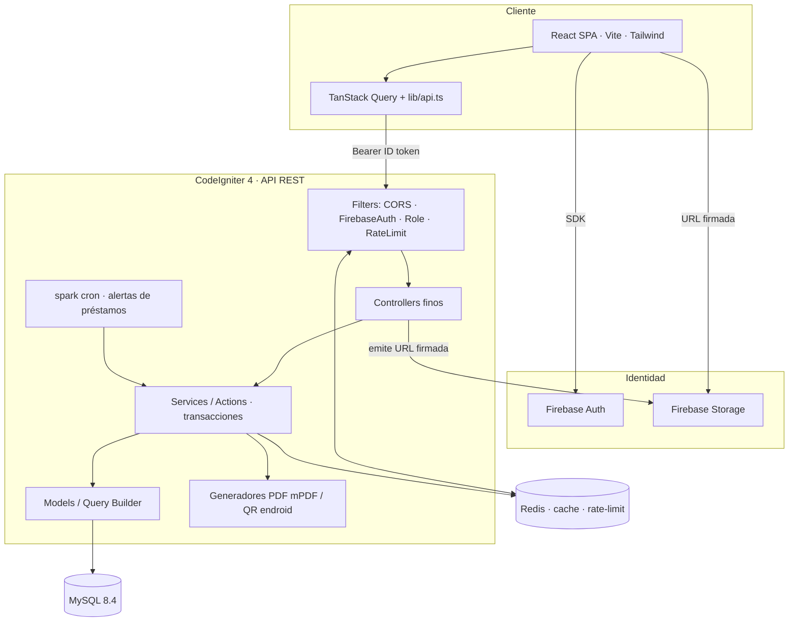
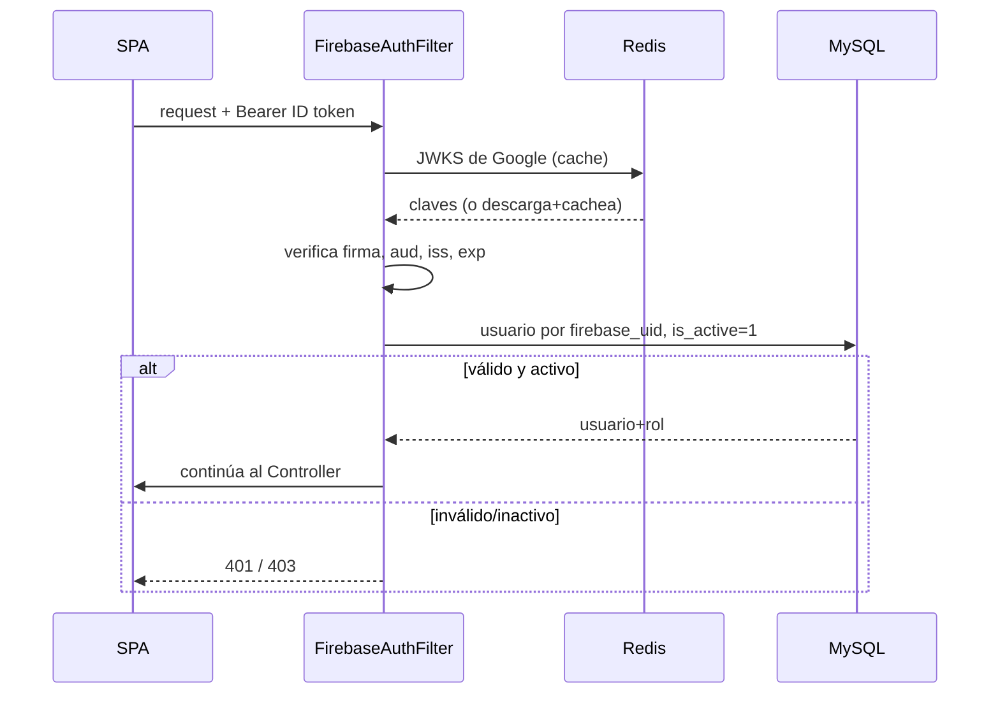
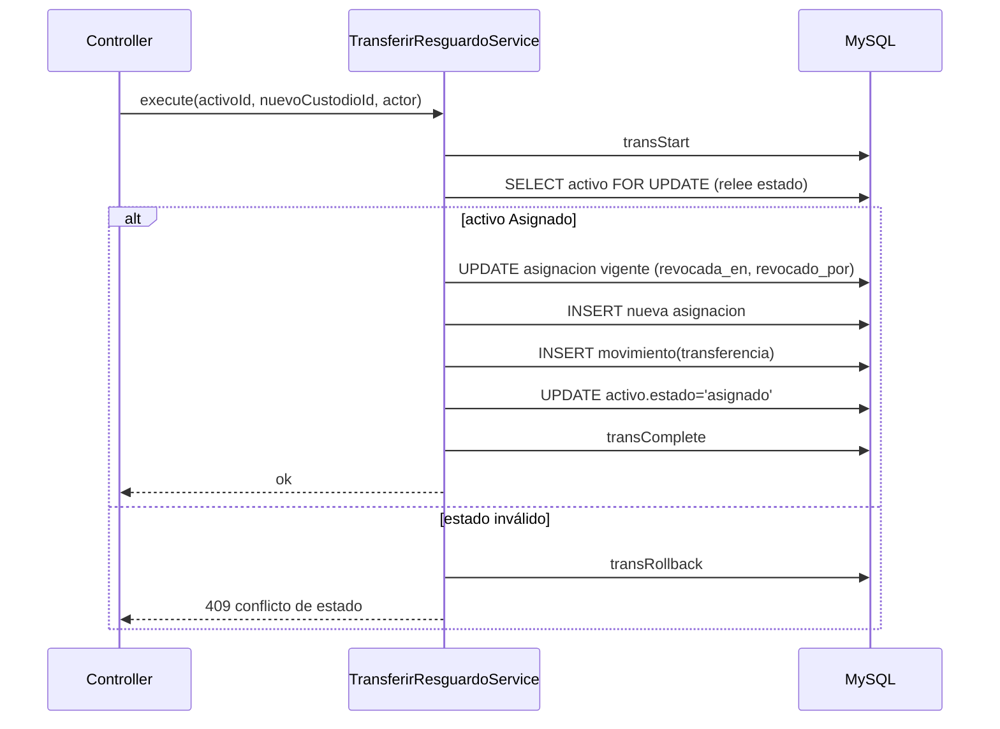
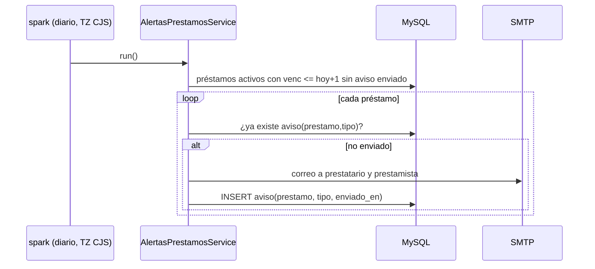
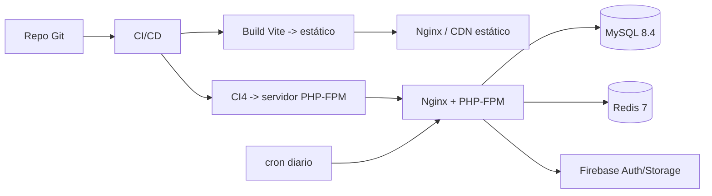

# 02 — Arquitectura del Sistema

| Campo | Valor |
|---|---|
| Documento | 02 — Arquitectura del Sistema |
| Proyecto | SiRe — Sistema de Resguardos OSC |
| Versión | 1.0 |
| Fecha | 2026-07-17 |
| Depende de | [01_SRS](../01-vision/01_SRS_especificacion_requisitos.md), [ADR-001](ADR/ADR-001_stack_ci4_react.md), [ADR-002](ADR/ADR-002_firebase_auth_storage.md), [ADR-003](ADR/ADR-003_modelo_acceso_roles.md) |

## 1. Principios rectores

1. **Desacople front/back.** SPA React estática + API REST CI4 sin estado. *Justificación:* despliegue y escalado independientes; contrato de API tipado como frontera única (ADR-001).
2. **Seguridad por diseño.** Verificación de ID token en cada request, PII restringida, transacciones atómicas, bitácora inmutable, secretos fuera del repo. *Justificación:* reglas 3, 4, 8, 10, 11 de la definición.
3. **Integridad del dominio primero.** Toda operación multi-tabla es transaccional; los identificadores son correlativos y a prueba de concurrencia; el historial no se altera. *Justificación:* el valor del sistema es la confianza en el dato (§3 de la definición).
4. **Lógica en Services, controllers finos.** Los controladores validan entrada y delegan; la lógica de negocio y las transacciones viven en Services/Actions de responsabilidad única. *Justificación:* SOLID, testabilidad, cero duplicación.
5. **Rendimiento consciente.** Carga por lotes (anti N+1), paginación, caché de lecturas calientes en Redis. *Justificación:* RNF-01.

## 2. Estilo arquitectónico

**SPA + API REST en capas**, stateless con autenticación por Bearer token (Firebase ID token). Se elige sobre un monolito server-rendered (F2) porque el stack destino desacopla UI y datos (ADR-001) y sobre microservicios porque el dominio es acotado y un único servicio CI4 bien estructurado cubre el MVP sin la complejidad operativa de la distribución (YAGNI).

## 3. Diagrama de capas



**Capas (presentación → auditoría):**

1. **Presentación (React).** Componentes, rutas, estados de UI; sin lógica de negocio ni de autorización.
2. **Acceso a datos remoto (front).** `lib/api.ts` (interfaz `ApiClient`) + TanStack Query: caché, reintentos, estados carga/error.
3. **Borde de API (Filters CI4).** CORS estricto, verificación de ID token, resolución de rol, rate limiting.
4. **Controladores.** Validan entrada, mapean request→DTO, delegan al Service, formatean respuesta/errores.
5. **Servicios/Actions.** Lógica de negocio, precondiciones de estado, transacciones ACID, emisión de movimientos.
6. **Modelos/Query Builder.** Acceso a MySQL con binding de parámetros y carga por lotes.
7. **Persistencia.** MySQL 8.4 (dominio) + Firebase Storage (archivos, referenciados).
8. **Caché/limitación.** Redis: JWKS de Google, resumen del dashboard, contadores de rate-limit.
9. **Procesos programados.** `spark` cron: detección de vencimientos y correo idempotente.
10. **Auditoría.** Bitácora `movimientos` (append-only) + columnas `creado_por`/`actualizado_por`.

## 4. Flujos de datos críticos

### 4.1 Verificación de token y resolución de rol



### 4.2 Transferencia de resguardo (atómica)



### 4.3 Alerta de préstamo vencido (cron idempotente)



## 5. Patrones de implementación

### 5.1 Filter de verificación de token (CI4)

```php
<?php
namespace App\Filters;

use CodeIgniter\Filters\FilterInterface;
use CodeIgniter\HTTP\{RequestInterface, ResponseInterface};
use App\Libraries\FirebaseTokenVerifier;
use App\Models\UsuarioModel;

final class FirebaseAuthFilter implements FilterInterface
{
    public function before(RequestInterface $request, $arguments = null)
    {
        $header = $request->getHeaderLine('Authorization');
        if (! str_starts_with($header, 'Bearer ')) {
            return service('response')->setStatusCode(401)
                ->setJSON(['error' => 'token_ausente']);
        }

        try {
            // Verifica firma, aud (project id), iss y exp contra JWKS (cacheado en Redis).
            $claims = service(FirebaseTokenVerifier::class)->verify(substr($header, 7));
        } catch (\Throwable $e) {
            return service('response')->setStatusCode(401)
                ->setJSON(['error' => 'token_invalido']);
        }

        $usuario = (new UsuarioModel())
            ->where('firebase_uid', $claims['sub'])
            ->where('is_active', 1)
            ->first();

        if ($usuario === null) {
            return service('response')->setStatusCode(403)
                ->setJSON(['error' => 'cuenta_inactiva']);
        }

        // Expone el usuario autenticado al resto del request.
        service('request')->user = $usuario;
    }

    public function after(RequestInterface $request, ResponseInterface $response, $arguments = null) {}
}
```

### 5.2 Service transaccional con precondición de estado

```php
<?php
namespace App\Services\Prestamos;

use App\Models\{ActivoModel, PrestamoModel, MovimientoModel};

final class CrearPrestamoService
{
    public function __construct(
        private ActivoModel $activos,
        private PrestamoModel $prestamos,
        private MovimientoModel $movimientos,
    ) {}

    public function execute(int $activoId, array $datos, int $actorId): int
    {
        $db = db_connect();
        $db->transException(true)->transStart();

        // Relee con bloqueo para evitar carreras de estado.
        $activo = $this->activos->db->table('activos')
            ->where('id', $activoId)->getRow(); // FOR UPDATE en el builder real

        if ($activo->estado !== 'disponible') {
            $db->transRollback();
            throw new \DomainException('activo_no_disponible', 409);
        }

        $prestamoId = $this->prestamos->insert([
            'activo_id'          => $activoId,
            'prestatario_id'     => $datos['prestatario_id'],
            'prestamista_id'     => $datos['prestamista_id'],
            'prestado_por'       => $actorId,
            'devolucion_esperada'=> $datos['devolucion_esperada'],
            'condicion_prestamo' => $datos['condicion_prestamo'],
        ], true);

        $this->movimientos->insert([
            'activo_id'     => $activoId,
            'tipo'          => 'prestamo',
            'realizado_por' => $actorId,
            'a_usuario_id'  => $datos['prestatario_id'],
        ]);

        $this->activos->update($activoId, ['estado' => 'prestado']);

        $db->transComplete();
        return $prestamoId;
    }
}
```

### 5.3 Generación de código físico a prueba de concurrencia

```php
// Dentro de la transacción de alta del activo:
// 1) SELECT ... FOR UPDATE sobre una fila de secuencia por (categoria_id, organizacion_id)
// 2) consecutivo = secuencia.ultimo + 1  ->  UPDATE secuencia
// 3) codigo = sprintf('%s-%s-%03d', cat.clave, org.clave, consecutivo)
// El bloqueo de fila garantiza que dos altas simultáneas no reciban el mismo consecutivo.
```

## 6. Estrategia de despliegue



- **Frontend:** build estático servido por Nginx/CDN; variables públicas de Firebase en tiempo de build.
- **Backend:** CI4 sobre Nginx + PHP-FPM (VPS). `.env` con credenciales (DB, Redis, SMTP, service account de Firebase) fuera de webroot.
- **Datos:** MySQL 8.4 y Redis 7 (Docker o servicios del VPS). TZ del servidor y de la BD en `America/Ciudad_Juarez`.
- **Cron:** entrada diaria que ejecuta `php spark resguardos:alertas-prestamos`.
- **CORS:** orígenes permitidos explícitos (dominio del frontend).

## 7. Decisiones pendientes / riesgos

| Riesgo | Mitigación |
|---|---|
| Caída de Firebase Auth | JWKS cacheado en Redis; mensaje claro de "auth no disponible"; el resto de lecturas cacheadas siguen sirviendo hasta expirar el token. |
| Doble escritura Firebase+MySQL en alta/baja de usuario | Operación con compensación: si falla MySQL tras crear el usuario Firebase, se elimina/deshabilita el usuario Firebase (o se reintenta) y se registra el fallo. |
| Reloj desincronizado (validación `exp`) | Tolerancia de reloj pequeña en la verificación; NTP en el servidor. |
| Crecimiento de `movimientos` | Índices por `activo_id` y `creado_en`; paginación; archivado futuro (post-MVP). |

---

*Arquitectura del Sistema · Proyecto SiRe / Grupo OSC Plan Juárez · v1.0 · 2026-07-17*
