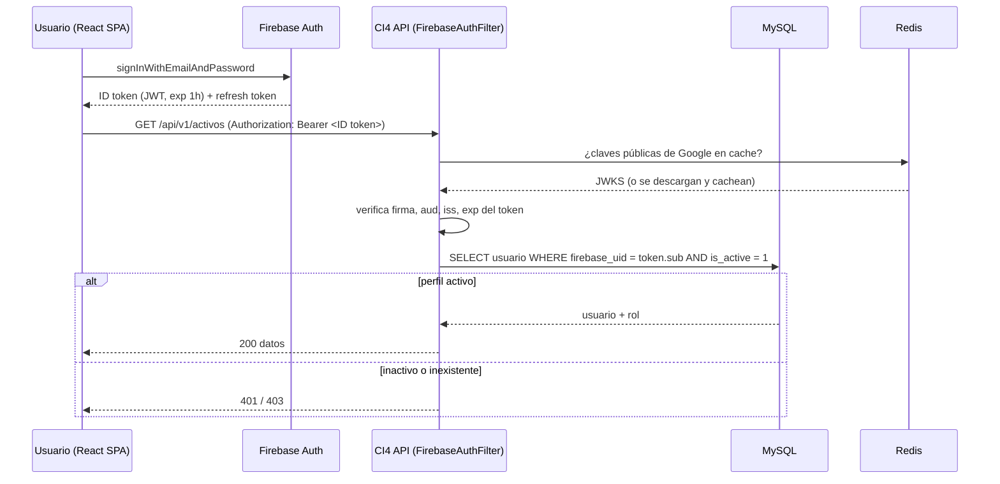

# ADR-002 — Firebase Authentication + Firebase Storage

| Campo | Valor |
|---|---|
| ADR | 002 |
| Título | Firebase como IdP único y almacén de archivos |
| Estado | Aceptado |
| Fecha | 2026-07-17 |
| Depende de | [ADR-001](ADR-001_stack_ci4_react.md), [00_auditoria_fuentes](../../00-fuentes/00_auditoria_fuentes.md) (H-04, H-06) |

## 1. Contexto

La Definición de Producto (§7, reglas 8–11) exige: (8) que desactivar un usuario invalide sus sesiones de inmediato, (9) política de registro explícita sin auto-registro anónimo, (10) **un solo mecanismo de autenticación** sin canales paralelos que consulten datos solo con contraseña, y (11) acceso restringido a datos personales. La regla 10 responde directamente a un defecto del proyecto anterior. Además, §6.4/§8 requieren almacenar copias digitalizadas de factura y etiquetas QR, dejando la ubicación a criterio de David.

## 2. Decisión

Usar **Firebase Authentication** como proveedor de identidad único y **Firebase Storage** como almacén de archivos.

| Aspecto | Antes (F2) | Ahora (decisión) |
|---|---|---|
| Identidad | Sanctum (sesión Laravel) | Firebase Auth (email/password; Google restringido a dominio, opcional) |
| Verificación en backend | Sesión server-side | CI4 verifica el **ID token** (JWT firmado por Google) en cada request |
| Origen del rol/permiso | Spatie en BD | Perfil local en MySQL (`usuarios.firebase_uid` ↔ rol) |
| Revocación | Invalidar sesión | Revocar refresh tokens en Firebase + `is_active=0` en MySQL (atómico) |
| Registro | Abierto/servidor | Solo Administrador crea (Firebase user + perfil MySQL) |
| Archivos | Filesystem local | Firebase Storage (referencia en MySQL) |

## 3. Flujo de autenticación

**Desactivación (regla 8):** el endpoint `PATCH /usuarios/{id}/desactivar` ejecuta, en una transacción con compensación, (a) `auth.revokeRefreshTokens(uid)` en Firebase Admin y (b) `UPDATE usuarios SET is_active=0`. El Filter rechaza cualquier token cuyo perfil esté inactivo aunque el ID token aún no haya expirado, y se puede comparar `auth_time` contra `tokensValidAfterTime`. No existe ninguna ruta que devuelva datos validando solo contraseña.

## 4. Consecuencias

**Positivas**
- Un único origen de identidad; se elimina de raíz el canal paralelo prohibido por la regla 10.
- Firebase gestiona hashing, verificación de correo, restablecimiento de contraseña y (opcional) 2FA, reduciendo superficie de código sensible propio.
- Storage con reglas de seguridad + URLs firmadas de expiración corta para servir facturas sin exponerlas públicamente.

**Negativas**
- Dependencia de un servicio externo (Google) y de su disponibilidad; se mitiga cacheando JWKS en Redis y degradando con claridad ante fallo.
- El backend necesita el **Firebase Admin SDK** (credencial de service account) protegido como secreto de máximo nivel.
- Doble escritura lógica en alta/baja de usuario (Firebase + MySQL): debe ser atómica con compensación ante fallo parcial.

**Neutrales**
- El perfil, rol y toda la lógica de negocio siguen en MySQL; Firebase solo aporta identidad y archivos.

## 5. Impacto en documentos

Arquitectura (02: capa de auth y storage), seguridad (04: verificación de token, revocación, reglas de Storage, protección de la service account), modelo de datos (03: `usuarios.firebase_uid`, columnas de referencia a archivos), API (05: contrato de auth y errores 401/403).

## 6. Implicaciones de seguridad

Verificar **siempre** `aud` (project id), `iss`, `exp` y firma del ID token contra las claves públicas vigentes; nunca confiar en el payload sin verificar. La service account del Admin SDK vive en `.env`/secret store, jamás en el repo ni en el frontend. Reglas de Storage: denegar por defecto; los objetos de factura solo se sirven vía URL firmada emitida por el backend tras validar permiso (Administrador/Auditor o titular). Rate limiting (Redis) en endpoints de auth y de emisión de URLs firmadas.

## 7. Plan de migración

Base nueva: se crea el proyecto Firebase, se configura el proveedor email/password, se siembra el primer Administrador (Firebase user + perfil MySQL vía Seeder). Sin datos previos que migrar.

---

*ADR-002 · Proyecto SiRe · v1.0 · 2026-07-17*
