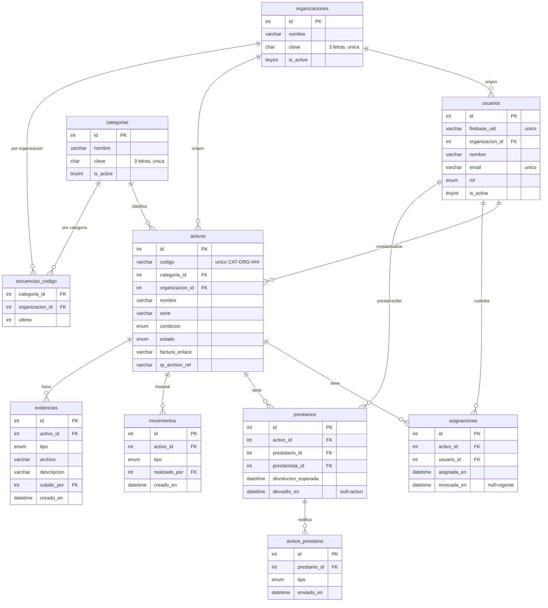

# 03 — Modelo de Datos

| Campo | Valor |
|---|---|
| Documento | 03 — Modelo de Datos |
| Proyecto | SiRe — Sistema de Resguardos OSC |
| Versión | 1.0 |
| Fecha | 2026-07-17 |
| Depende de | [01_SRS](../01-vision/01_SRS_especificacion_requisitos.md), [02_arquitectura](../02-arquitectura/02_arquitectura_sistema.md), [ADR-003](../02-arquitectura/ADR/ADR-003_modelo_acceso_roles.md) |

> **Fuente de verdad de datos.** El DDL de este documento es la referencia que el bloque JSON espejo del [demo (doc 09)](../demo-ux/09_demo_ux_guia.md) y el `InitialSeeder` de Fase 2 deben replicar sin transformación. Motor: MySQL 8.4, `utf8mb4`, InnoDB, TZ `America/Ciudad_Juarez`.

## 1. Diagrama entidad-relación



## 2. Diccionario de datos (resumen por tabla)

- **organizaciones** — OSC del grupo. `clave` CHAR(3) única alimenta el código de activo. `is_active` controla oferta en formularios; no restringe acceso.
- **categorias** — Clasificación de bienes. `clave` CHAR(3) única. Solo activas se ofrecen al crear activos.
- **usuarios** — Perfil local ligado a Firebase (`firebase_uid`). `rol` ∈ {administrador, custodio, auditor}. `organizacion_id` = origen (no scope). `is_active` = bloqueo real.
- **activos** — Inventario. `codigo` único `CAT-ORG-###`. `factura_enlace`: enlace de Google Drive a la factura (solo https de drive/docs.google.com; visible solo para administrador y auditor). `qr_archivo_ref` reservado (el QR se genera bajo demanda). `condicion` y `estado` como ENUM. Columnas de auditoría.
- **asignaciones** — Resguardo de largo plazo. Vigente si `revocada_en IS NULL`. Índice parcial de unicidad lógico: un activo tiene a lo sumo una asignación vigente (garantizado por la lógica transaccional + índice de apoyo).
- **prestamos** — Cesión temporal. Activo si `devuelto_en IS NULL`. Un activo no puede tener dos préstamos activos (lógica + índice).
- **movimientos** — Bitácora **append-only**: sin `updated_at`, sin `deleted_at`. Historial inmutable. Tipo `evidencia` al agregar o eliminar una foto.
- **evidencias** — Fotos del equipo y sus accesorios, clasificadas por `tipo` (equipo, accesorio, daño). Los archivos viven en disco del servidor (`writable/evidencias/`, fuera del webroot; `{archivo}` + miniatura `{nombre}_t.jpg`); la tabla guarda solo el nombre. Se sirven solo por la API con sesión; no aparecen en la ficha pública del QR.
- **secuencias_codigo** — Contador correlativo por (categoria_id, organizacion_id) para el código físico, bloqueado por fila en la transacción de alta.
- **avisos_prestamo** — Idempotencia de notificaciones: un aviso por (prestamo_id, tipo).

## 3. DDL completo (MySQL 8.4)

```sql
SET NAMES utf8mb4;
SET time_zone = '-06:00'; -- America/Ciudad_Juarez (sin DST desde 2022)

-- 1) ORGANIZACIONES
CREATE TABLE organizaciones (
    id          INT UNSIGNED AUTO_INCREMENT PRIMARY KEY,
    nombre      VARCHAR(150) NOT NULL,
    clave       CHAR(3) NOT NULL,
    is_active   TINYINT(1) NOT NULL DEFAULT 1,
    creado_en   DATETIME NOT NULL DEFAULT CURRENT_TIMESTAMP,
    actualizado_en DATETIME NOT NULL DEFAULT CURRENT_TIMESTAMP ON UPDATE CURRENT_TIMESTAMP,
    UNIQUE KEY uq_org_clave (clave),
    INDEX idx_org_activa (is_active)
) ENGINE=InnoDB DEFAULT CHARSET=utf8mb4 COLLATE=utf8mb4_0900_ai_ci;

-- 2) CATEGORIAS
CREATE TABLE categorias (
    id          INT UNSIGNED AUTO_INCREMENT PRIMARY KEY,
    nombre      VARCHAR(120) NOT NULL,
    clave       CHAR(3) NOT NULL,
    is_active   TINYINT(1) NOT NULL DEFAULT 1,
    creado_en   DATETIME NOT NULL DEFAULT CURRENT_TIMESTAMP,
    actualizado_en DATETIME NOT NULL DEFAULT CURRENT_TIMESTAMP ON UPDATE CURRENT_TIMESTAMP,
    UNIQUE KEY uq_cat_clave (clave),
    INDEX idx_cat_activa (is_active)
) ENGINE=InnoDB DEFAULT CHARSET=utf8mb4 COLLATE=utf8mb4_0900_ai_ci;

-- 3) USUARIOS  (perfil local; identidad en Firebase)
CREATE TABLE usuarios (
    id              INT UNSIGNED AUTO_INCREMENT PRIMARY KEY,
    firebase_uid    VARCHAR(128) NOT NULL,
    organizacion_id INT UNSIGNED NOT NULL,        -- origen, NO scope de acceso
    nombre          VARCHAR(150) NOT NULL,
    email           VARCHAR(180) NOT NULL,
    rol             ENUM('administrador','custodio','auditor') NOT NULL DEFAULT 'custodio',
    is_active       TINYINT(1) NOT NULL DEFAULT 1,
    creado_por      INT UNSIGNED NULL,
    creado_en       DATETIME NOT NULL DEFAULT CURRENT_TIMESTAMP,
    actualizado_en  DATETIME NOT NULL DEFAULT CURRENT_TIMESTAMP ON UPDATE CURRENT_TIMESTAMP,
    UNIQUE KEY uq_usuarios_firebase (firebase_uid),
    UNIQUE KEY uq_usuarios_email (email),
    INDEX idx_usuarios_org (organizacion_id),
    INDEX idx_usuarios_rol (rol),
    INDEX idx_usuarios_activo (is_active),
    CONSTRAINT fk_usuarios_org FOREIGN KEY (organizacion_id)
        REFERENCES organizaciones(id) ON DELETE RESTRICT ON UPDATE CASCADE,
    CONSTRAINT fk_usuarios_creador FOREIGN KEY (creado_por)
        REFERENCES usuarios(id) ON DELETE SET NULL
) ENGINE=InnoDB DEFAULT CHARSET=utf8mb4 COLLATE=utf8mb4_0900_ai_ci;

-- 4) SECUENCIAS_CODIGO  (correlativo por categoria+organizacion, a prueba de concurrencia)
CREATE TABLE secuencias_codigo (
    categoria_id    INT UNSIGNED NOT NULL,
    organizacion_id INT UNSIGNED NOT NULL,
    ultimo          INT UNSIGNED NOT NULL DEFAULT 0,
    PRIMARY KEY (categoria_id, organizacion_id),
    CONSTRAINT fk_seq_cat FOREIGN KEY (categoria_id) REFERENCES categorias(id) ON DELETE RESTRICT,
    CONSTRAINT fk_seq_org FOREIGN KEY (organizacion_id) REFERENCES organizaciones(id) ON DELETE RESTRICT
) ENGINE=InnoDB DEFAULT CHARSET=utf8mb4 COLLATE=utf8mb4_0900_ai_ci;

-- 5) ACTIVOS
CREATE TABLE activos (
    id              INT UNSIGNED AUTO_INCREMENT PRIMARY KEY,
    codigo          VARCHAR(40) NOT NULL,               -- CAT-ORG-### (formato en app)
    categoria_id    INT UNSIGNED NOT NULL,
    organizacion_id INT UNSIGNED NOT NULL,              -- origen
    nombre          VARCHAR(200) NOT NULL,
    descripcion     TEXT NULL,
    marca           VARCHAR(100) NULL,
    modelo          VARCHAR(100) NULL,
    serie           VARCHAR(150) NULL,
    -- Datos de compra / factura
    fecha_compra        DATE NULL,
    valor_compra        DECIMAL(12,2) NULL,
    proveedor           VARCHAR(200) NULL,              -- proveedor / dónde se compró
    factura_numero      VARCHAR(80) NULL,
    factura_enlace      VARCHAR(500) NULL,              -- enlace de Google Drive a la factura
    -- Identificación
    qr_archivo_ref  VARCHAR(500) NULL,                  -- etiqueta QR en Firebase Storage
    -- Clasificación de estado
    condicion       ENUM('excelente','bueno','regular','malo','baja') NOT NULL DEFAULT 'bueno',
    estado          ENUM('disponible','asignado','prestado','mantenimiento','baja') NOT NULL DEFAULT 'disponible',
    baja_motivo     VARCHAR(500) NULL,
    -- Auditoría
    creado_por      INT UNSIGNED NOT NULL,
    actualizado_por INT UNSIGNED NULL,
    creado_en       DATETIME NOT NULL DEFAULT CURRENT_TIMESTAMP,
    actualizado_en  DATETIME NOT NULL DEFAULT CURRENT_TIMESTAMP ON UPDATE CURRENT_TIMESTAMP,
    UNIQUE KEY uq_activos_codigo (codigo),
    INDEX idx_activos_categoria (categoria_id),
    INDEX idx_activos_org (organizacion_id),
    INDEX idx_activos_estado (estado),
    INDEX idx_activos_condicion (condicion),
    INDEX idx_activos_serie (serie),
    CONSTRAINT fk_activos_cat FOREIGN KEY (categoria_id) REFERENCES categorias(id) ON DELETE RESTRICT,
    CONSTRAINT fk_activos_org FOREIGN KEY (organizacion_id) REFERENCES organizaciones(id) ON DELETE RESTRICT,
    CONSTRAINT fk_activos_creador FOREIGN KEY (creado_por) REFERENCES usuarios(id) ON DELETE RESTRICT,
    CONSTRAINT fk_activos_editor FOREIGN KEY (actualizado_por) REFERENCES usuarios(id) ON DELETE RESTRICT
) ENGINE=InnoDB DEFAULT CHARSET=utf8mb4 COLLATE=utf8mb4_0900_ai_ci;

-- 6) ASIGNACIONES  (resguardo de largo plazo)
CREATE TABLE asignaciones (
    id              INT UNSIGNED AUTO_INCREMENT PRIMARY KEY,
    activo_id       INT UNSIGNED NOT NULL,
    usuario_id      INT UNSIGNED NOT NULL,              -- custodio
    organizacion_id INT UNSIGNED NOT NULL,              -- org del custodio al momento
    asignada_en     DATETIME NOT NULL DEFAULT CURRENT_TIMESTAMP,
    asignada_por    INT UNSIGNED NOT NULL,
    revocada_en     DATETIME NULL,                      -- NULL = vigente
    revocada_por    INT UNSIGNED NULL,
    revocacion_motivo VARCHAR(500) NULL,
    notas           VARCHAR(500) NULL,
    creado_en       DATETIME NOT NULL DEFAULT CURRENT_TIMESTAMP,
    actualizado_en  DATETIME NOT NULL DEFAULT CURRENT_TIMESTAMP ON UPDATE CURRENT_TIMESTAMP,
    INDEX idx_asig_activo (activo_id),
    INDEX idx_asig_usuario (usuario_id),
    INDEX idx_asig_vigente (activo_id, revocada_en),    -- localizar la asignación vigente
    CONSTRAINT fk_asig_activo FOREIGN KEY (activo_id) REFERENCES activos(id) ON DELETE RESTRICT,
    CONSTRAINT fk_asig_usuario FOREIGN KEY (usuario_id) REFERENCES usuarios(id) ON DELETE RESTRICT,
    CONSTRAINT fk_asig_org FOREIGN KEY (organizacion_id) REFERENCES organizaciones(id) ON DELETE RESTRICT,
    CONSTRAINT fk_asig_asignador FOREIGN KEY (asignada_por) REFERENCES usuarios(id) ON DELETE RESTRICT
) ENGINE=InnoDB DEFAULT CHARSET=utf8mb4 COLLATE=utf8mb4_0900_ai_ci;

-- 7) PRESTAMOS  (temporal)
CREATE TABLE prestamos (
    id                  INT UNSIGNED AUTO_INCREMENT PRIMARY KEY,
    activo_id           INT UNSIGNED NOT NULL,
    prestatario_id      INT UNSIGNED NOT NULL,          -- quien recibe
    prestamista_id      INT UNSIGNED NOT NULL,          -- custodio/origen
    prestado_por        INT UNSIGNED NOT NULL,          -- quien autorizó
    prestado_en         DATETIME NOT NULL DEFAULT CURRENT_TIMESTAMP,
    devolucion_esperada DATETIME NOT NULL,
    devuelto_en         DATETIME NULL,                  -- NULL = activo
    devuelto_a          INT UNSIGNED NULL,
    condicion_prestamo  ENUM('excelente','bueno','regular','malo') NOT NULL,
    condicion_devolucion ENUM('excelente','bueno','regular','malo') NULL,
    notas               VARCHAR(500) NULL,
    creado_en           DATETIME NOT NULL DEFAULT CURRENT_TIMESTAMP,
    actualizado_en      DATETIME NOT NULL DEFAULT CURRENT_TIMESTAMP ON UPDATE CURRENT_TIMESTAMP,
    INDEX idx_prest_activo (activo_id),
    INDEX idx_prest_prestatario (prestatario_id),
    INDEX idx_prest_activo_estado (activo_id, devuelto_en),  -- préstamo activo por activo
    INDEX idx_prest_venc (devolucion_esperada),               -- alertas
    CONSTRAINT fk_prest_activo FOREIGN KEY (activo_id) REFERENCES activos(id) ON DELETE RESTRICT,
    CONSTRAINT fk_prest_prestatario FOREIGN KEY (prestatario_id) REFERENCES usuarios(id) ON DELETE RESTRICT,
    CONSTRAINT fk_prest_prestamista FOREIGN KEY (prestamista_id) REFERENCES usuarios(id) ON DELETE RESTRICT,
    CONSTRAINT fk_prest_autoriza FOREIGN KEY (prestado_por) REFERENCES usuarios(id) ON DELETE RESTRICT
) ENGINE=InnoDB DEFAULT CHARSET=utf8mb4 COLLATE=utf8mb4_0900_ai_ci;

-- 8) MOVIMIENTOS  (bitácora inmutable, append-only)
CREATE TABLE movimientos (
    id              BIGINT UNSIGNED AUTO_INCREMENT PRIMARY KEY,
    activo_id       INT UNSIGNED NOT NULL,
    tipo            ENUM('alta','asignacion','revocacion','prestamo','devolucion','transferencia','mantenimiento','baja','evidencia') NOT NULL,
    de_usuario_id   INT UNSIGNED NULL,
    a_usuario_id    INT UNSIGNED NULL,
    de_org_id       INT UNSIGNED NULL,
    a_org_id        INT UNSIGNED NULL,
    realizado_por   INT UNSIGNED NOT NULL,
    notas           VARCHAR(500) NULL,
    creado_en       DATETIME NOT NULL DEFAULT CURRENT_TIMESTAMP,   -- sin updated/deleted: inmutable
    INDEX idx_mov_activo (activo_id),
    INDEX idx_mov_tipo (tipo),
    INDEX idx_mov_creado (creado_en),
    CONSTRAINT fk_mov_activo FOREIGN KEY (activo_id) REFERENCES activos(id) ON DELETE RESTRICT,
    CONSTRAINT fk_mov_actor FOREIGN KEY (realizado_por) REFERENCES usuarios(id) ON DELETE RESTRICT
) ENGINE=InnoDB DEFAULT CHARSET=utf8mb4 COLLATE=utf8mb4_0900_ai_ci;

-- EVIDENCIAS  (fotos del activo; archivo en disco local, fuera del webroot)
CREATE TABLE evidencias (
    id          INT UNSIGNED AUTO_INCREMENT PRIMARY KEY,
    activo_id   INT UNSIGNED NOT NULL,
    tipo        ENUM('equipo','accesorio','dano') NOT NULL DEFAULT 'equipo',
    archivo     VARCHAR(100) NOT NULL,                 -- {32 hex}.jpg; miniatura {32 hex}_t.jpg
    descripcion VARCHAR(255) NULL,
    ancho       SMALLINT UNSIGNED NOT NULL,
    alto        SMALLINT UNSIGNED NOT NULL,
    bytes       INT UNSIGNED NOT NULL,
    subido_por  INT UNSIGNED NOT NULL,
    creado_en   DATETIME NOT NULL DEFAULT CURRENT_TIMESTAMP,
    UNIQUE KEY uq_evidencia_archivo (archivo),
    INDEX idx_evidencia_activo (activo_id),
    CONSTRAINT fk_evidencia_activo FOREIGN KEY (activo_id) REFERENCES activos(id) ON DELETE RESTRICT,
    CONSTRAINT fk_evidencia_usuario FOREIGN KEY (subido_por) REFERENCES usuarios(id) ON DELETE RESTRICT
) ENGINE=InnoDB DEFAULT CHARSET=utf8mb4 COLLATE=utf8mb4_0900_ai_ci;

-- 9) AVISOS_PRESTAMO  (idempotencia de notificaciones)
CREATE TABLE avisos_prestamo (
    id          BIGINT UNSIGNED AUTO_INCREMENT PRIMARY KEY,
    prestamo_id INT UNSIGNED NOT NULL,
    tipo        ENUM('por_vencer','vencido') NOT NULL,
    enviado_en  DATETIME NOT NULL DEFAULT CURRENT_TIMESTAMP,
    UNIQUE KEY uq_aviso (prestamo_id, tipo),
    CONSTRAINT fk_aviso_prestamo FOREIGN KEY (prestamo_id) REFERENCES prestamos(id) ON DELETE CASCADE
) ENGINE=InnoDB DEFAULT CHARSET=utf8mb4 COLLATE=utf8mb4_0900_ai_ci;
```

## 4. Justificaciones de diseño

- **`movimientos` sin `updated_at`/`deleted_at`.** Materializa la inmutabilidad (RF-32/regla 3) a nivel de esquema: no hay columnas de mutación, y la capa de datos no expone `update`/`delete` para esta tabla. `BIGINT` por su crecimiento monótono.
- **`secuencias_codigo` como tabla propia.** Aísla el contador para bloquear solo esa fila (`SELECT ... FOR UPDATE`) durante el alta, evitando bloquear `activos` y garantizando correlativos únicos por (categoría, organización) ante concurrencia (RF-15).
- **`organizacion_id` conservado sin semántica de scope.** Necesario para el origen y los códigos (ADR-003); ningún índice ni consulta lo usa para restringir acceso.
- **`ON DELETE RESTRICT` en todo lo referenciado por historial.** Impide borrar entidades que dejarían movimientos huérfanos; las "bajas" son estados, no borrados.
- **Unicidad de asignación/préstamo activos.** Se garantiza en el Service transaccional (relee con bloqueo y valida estado); los índices `(activo_id, revocada_en)` y `(activo_id, devuelto_en)` hacen eficiente localizar el registro vigente.
- **`DECIMAL(12,2)` para valores monetarios.** Nunca `FLOAT`.
- **Referencias a archivos, no BLOBs.** Los archivos viven en Firebase Storage; MySQL guarda solo la ruta (ADR-002).

## 5. Datos semilla mínimos (Seeder)

- 1 Administrador inicial (perfil MySQL + usuario Firebase correspondiente).
- Organizaciones del grupo con sus claves de 3 letras (provistas por el cliente al inicio).
- Categorías base con claves (p. ej. `CMP` Cómputo, `MOB` Mobiliario).
- `secuencias_codigo` se inicializa en 0 por (categoría, organización) bajo demanda en el alta.

> El bloque JSON espejo del [doc 09](../demo-ux/09_demo_ux_guia.md) usa exactamente estas tablas, columnas, enums y FKs, con dominios `@demo.test` y sin PII real.

---

*Modelo de Datos · Proyecto SiRe / Grupo OSC Plan Juárez · v1.0 · 2026-07-17*
