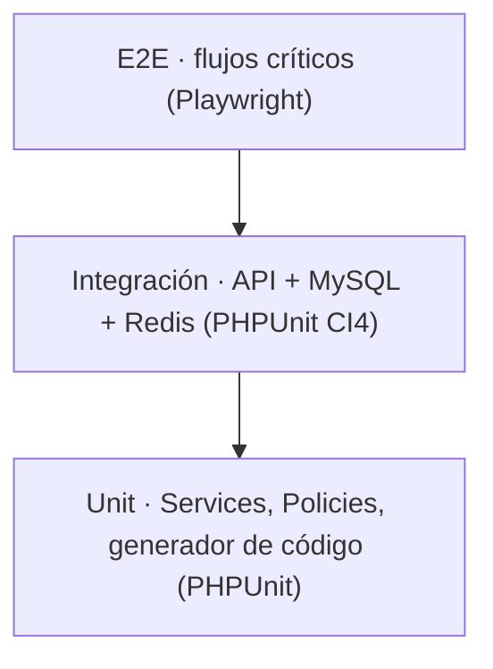

# 06 — Plan de Pruebas

| Campo | Valor |
|---|---|
| Documento | 06 — Plan de Pruebas |
| Proyecto | SiRe — Sistema de Resguardos OSC |
| Versión | 1.0 |
| Fecha | 2026-07-17 |
| Depende de | [01_SRS](../01-vision/01_SRS_especificacion_requisitos.md), [04_plan_de_seguridad](../04-seguridad/04_plan_de_seguridad.md), [05_especificacion_api](../05-api/05_especificacion_api.md) |

## 1. Pirámide de pruebas

- **Backend:** PHPUnit (CI4). `DatabaseTestTrait` con migraciones + refresh; nunca mocks para la BD en pruebas de integración.
- **Frontend:** Vitest + React Testing Library (componentes) y Playwright (E2E de flujos críticos).
- **Cobertura objetivo:** Services 100% · Policies 100% · Controllers 85% · componentes con lógica 80%.

## 2. Casos por módulo

### 2.1 Autenticación y cuentas
- Token válido + perfil activo → 200. Token inválido/expirado → 401. Perfil inactivo → 403.
- Desactivar usuario → sus requests posteriores 401/403 aunque el ID token siga vigente (revocación).
- No existe endpoint/pantalla de auto-registro.

### 2.2 Organizaciones y categorías
- Crear con clave de 3 letras única → 201; clave duplicada → 422; clave ≠ 3 letras → 400.
- Desactivar → no se ofrece en formularios de alta de activo/usuario.

### 2.3 Usuarios y roles
- Solo Administrador crea/edita usuarios (Custodio/Auditor → 403).
- Cambiar rol a Administrador solo por Administrador.
- Auto-desactivación → 403. Auto-cambio de rol → 403.
- PII: `GET /usuarios/{id}` por Custodio/Auditor sobre ficha ajena → 403; titular sobre la propia → 200.

### 2.4 Activos e identificación
- Alta genera código `CAT-ORG-###` correlativo por (categoría, organización) y QR único.
- **Concurrencia:** dos altas simultáneas de la misma (categoría, organización) producen consecutivos distintos (test con transacciones paralelas / bloqueo de `secuencias_codigo`).
- Búsqueda por código, nombre y serie; filtros por categoría/estado/condición/organización.
- Subida de factura → referencia en Storage; descarga solo por URL firmada (admin/auditor).

### 2.5 Asignaciones
- Asignar activo `disponible` → `asignado` + movimiento `asignacion`.
- Asignar activo no disponible → 409.
- Revocar → `disponible` + movimiento `revocacion`.
- Transferir → atómico: revoca + reasigna + movimiento `transferencia`; si falla un paso, rollback total.

### 2.6 Préstamos
- Prestar activo `disponible` → `prestado` + movimiento `prestamo`.
- Segundo préstamo activo sobre el mismo activo → 409.
- Devolver → `disponible` + condición registrada + movimiento `devolucion`.
- Custodio devuelve lo que le corresponde; ajeno → 403.

### 2.7 Alertas
- `spark resguardos:alertas-prestamos` envía a préstamos por vencer (hoy+1) y vencidos.
- **Idempotencia:** segunda ejecución el mismo día no reenvía (unicidad `avisos_prestamo`).

### 2.8 Bitácora
- Cada operación inserta exactamente un movimiento del tipo correcto.
- No existe ruta para editar/borrar movimientos (verificación de rutas).

### 2.9 Dashboard y reportes
- Totales por estado coinciden con la BD; préstamos vencidos = activos con `devolucion_esperada < hoy`.
- Reportes de inventario y movimientos generan PDF con los filtros aplicados.

## 3. Máquina de estados — cobertura exhaustiva

| Desde \ Acción | asignar | revocar | transferir | prestar | devolver | mant. | baja |
|---|---|---|---|---|---|---|---|
| disponible | ✅→asignado | 409 | 409 | ✅→prestado | 409 | ✅→mant. | ✅→baja |
| asignado | 409 | ✅→disponible | ✅→asignado | 409 | 409 | 409 | ✅→baja |
| prestado | 409 | 409 | 409 | 409 | ✅→disponible | 409 | 409 |
| mantenimiento | 409 | 409 | 409 | 409 | 409 | ✅→disponible | ✅→baja |
| baja | 409 | 409 | 409 | 409 | 409 | 409 | 409 |

Cada celda ✅ y cada 409 es un caso de prueba.

## 4. Casos negativos OWASP

- A01: mutaciones por Custodio/Auditor → 403; PII ajena → 403.
- A03: inyección en `?q=` no altera la consulta (binding).
- A07: token con `aud`/`iss` incorrecto → 401; perfil inactivo → 403.
- A04/A08: carrera de estado (asignar/prestar en paralelo) → solo una gana, la otra 409; sin doble consecutivo de código.
- A05: CORS desde origen no permitido → bloqueado; factura sin URL firmada → 403.

## 5. Umbrales de rendimiento

- Listado de activos (5 000 registros) con filtros: < 400 ms server-side; consultas sin N+1 (verificado con log de queries).
- Dashboard: < 300 ms con caché Redis caliente.
- Generación de carta/reporte PDF: < 2 s.

## 6. Matriz de trazabilidad RF ↔ pruebas

| RF | Caso(s) |
|---|---|
| RF-01/05 | 2.1 auth + revocación |
| RF-06/09 | 2.2 claves únicas + oferta |
| RF-10/13 | 2.3 roles, auto-perjuicio, PII |
| RF-14/16 | 2.4 alta, código concurrente, QR |
| RF-17/18 | 2.4 factura, búsqueda/filtros |
| RF-21/23 | 2.5 asignar/revocar/transferir |
| RF-24 | 2.3 carta (admin/titular) |
| RF-25/28 | 2.6 préstamos + doble activo |
| RF-29/30 | 2.7 alertas idempotentes |
| RF-31/32 | 2.8 bitácora inmutable |
| RF-33/35 | 2.9 dashboard + reportes |

## 7. Criterios de aceptación para release

- Toda la matriz de estados cubierta (✅ y 409).
- Cobertura de Services y Policies al 100%.
- Casos negativos OWASP verdes.
- Umbrales de rendimiento cumplidos; cero N+1 auditado.
- Checklist de seguridad (doc 04 §5) completo.

---

*Plan de Pruebas · Proyecto SiRe / Grupo OSC Plan Juárez · v1.0 · 2026-07-17*
