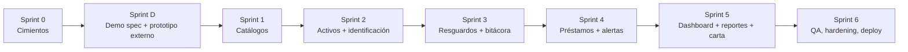

# 07 — Roadmap por Sprints

| Campo | Valor |
|---|---|
| Documento | 07 — Roadmap por Sprints |
| Proyecto | SiRe — Sistema de Resguardos OSC |
| Versión | 1.0 |
| Fecha | 2026-07-17 |
| Depende de | Todos los documentos 01–06 y [demo 09](../demo-ux/09_demo_ux_guia.md) |

## 1. Principio rector

**Cimientos de seguridad antes que funcionalidades.** El Sprint 0 levanta auth, esquema y controles transversales; recién entonces se construyen los módulos de negocio. Entre Sprint 0 y Sprint 1 se ubica el **Sprint D** (especificación y prototipo del demo en herramienta externa), conforme a Demo-First v2.1.

## 2. Línea de sprints

## 3. Detalle de sprints

### Sprint 0 — Cimientos (Fase 2 base)
Proyecto CI4 + proyecto Vite; Docker de MySQL 8.4 y Redis 7; migraciones del doc 03; `FirebaseAuthFilter` + verificación de ID token (JWKS en Redis); `RoleFilter`; Seeder inicial (Administrador + organizaciones + categorías); CORS, cabeceras de seguridad, rate limiting; CI (composer/npm audit, PHPUnit, Vitest). **Hito:** login end-to-end con token verificado y rol resuelto; desactivación revoca acceso.

### Sprint D — Especificación y prototipo del demo
Redacción de `demo-ux/09_demo_ux_guia.md` (pantallas, navegación, estados, bloque JSON espejo del DDL, interfaz `ApiClient`, WCAG, responsive) y **construcción del prototipo en la herramienta externa**; validación con stakeholder; bitácora hallazgos→cambios. **Gates v3:** verificar bloque JSON ↔ DDL (doc 03); re-sincronizar SRS(01) y API(05); **congelar** el contrato `ApiClient`. **Hito:** stakeholder recorre el prototipo sin backend; contrato congelado.

### Sprint 1 — Catálogos
CRUD Organizaciones, Categorías, Usuarios/roles; alta de usuario (Firebase + perfil); reglas de auto-perjuicio y escalamiento; claves de 3 letras. **Hito:** administración del grupo operativa; pruebas de roles verdes.

### Sprint 2 — Activos e identificación
CRUD de activos; **generación de código correlativo a prueba de concurrencia** (`secuencias_codigo`); generación de QR; etiqueta imprimible; subida de factura a Storage + URL firmada; búsqueda y filtros. **Hito:** alta de activo con código + QR + factura; escaneo abre ficha.

### Sprint 3 — Resguardos y bitácora
Asignar, revocar, transferir (atómico); bitácora `movimientos` append-only; historial en la ficha; carta responsiva (base). **Hito:** ciclo de resguardo completo con historial inmutable.

### Sprint 4 — Préstamos y alertas
Prestar, devolver, estados derivados; comando `spark resguardos:alertas-prestamos` (cron, TZ CJS) con idempotencia (`avisos_prestamo`); correos SMTP. **Hito:** préstamos con detección de vencidos y alertas sin repetición.

### Sprint 5 — Dashboard, reportes y carta
Dashboard (totales, activos/vencidos, últimos movimientos, por organización, caché Redis); reportes PDF de inventario y movimientos; carta responsiva final (cláusulas + firmas). **Hito:** vistas de estado y PDFs de negocio.

### Sprint 6 — QA, hardening y despliegue
Cobertura objetivo; casos negativos OWASP; checklist de seguridad; UAT; ajuste de rendimiento (cero N+1); despliegue a producción (Nginx + PHP-FPM, front estático, cron). **Hito:** sistema en producción con DoD de Fase 2 verificada.

## 4. Definición de Hecho — Fase 2 (Backend) · Gobernanza v3

- [ ] Cero N+1 auditado (no asumido) en listados.
- [ ] Toda Policy con prueba negativa (403/401).
- [ ] El bloque JSON del doc 09 sembró la BD real vía `InitialSeeder` sin transformación manual.
- [ ] Cobertura y análisis estático del doc 06 verificados con el comando real.
- [ ] Controles OWASP del doc 04 re-verificados contra el código final.
- [ ] Transacciones multi-tabla del doc 02 confirmadas en código (asignar/revocar/transferir/prestar/devolver/baja).
- [ ] Interfaz `api.ts` idéntica a la del doc 05 (contrato congelado).
- [ ] Generación de código a prueba de concurrencia verificada con test de carrera.

## 5. Riesgos y mitigaciones

| Riesgo | Mitigación |
|---|---|
| Retraso en datos del cliente (organizaciones/claves) | Sprint 0 arranca con datos de ejemplo; se sustituyen antes del UAT |
| Caída de Firebase | JWKS cacheado; degradación clara; ver ADR-002 |
| Carreras de estado/código | Bloqueo de fila en transacción; tests de concurrencia en Sprint 2/3 |
| Crecimiento de bitácora | Índices + paginación; archivado post-MVP |

## 6. Backlog post-MVP (definición §9)

Fotos del activo, firma electrónica con sello de tiempo, exportación Excel/CSV, centro de notificaciones in-app con recordatorios escalonados, flujo formal de mantenimiento/baja con aprobaciones, ubicaciones físicas con historial, depreciación, importación masiva, permisos configurables desde UI, portal ampliado del custodio, branding por organización, API pública, app móvil.

---

*Roadmap por Sprints · Proyecto SiRe / Grupo OSC Plan Juárez · v1.0 · 2026-07-17*
