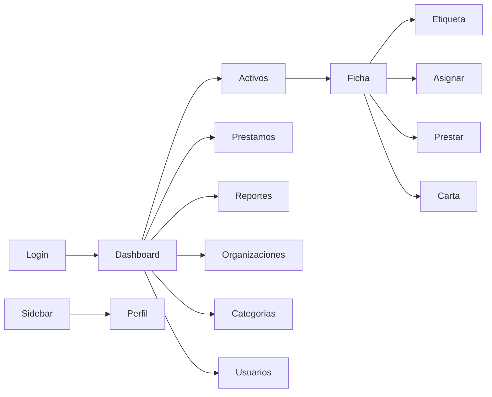

# 09 — Guía del Demo UX

| Campo | Valor |
|---|---|
| Documento | 09 — Guía del Demo UX (especificación completa) |
| Proyecto | SiRe — Sistema de Resguardos OSC |
| Versión | 1.0 |
| Fecha | 2026-07-17 |
| Depende de | [01_SRS](../01-vision/01_SRS_especificacion_requisitos.md), [03_modelo_de_datos](../03-datos/03_modelo_de_datos.md), [05_especificacion_api](../05-api/05_especificacion_api.md), [08_design_system](../01-vision/08_identidad_visual_design_system.md) |

> **Naturaleza (Demo-First v2.1).** Este documento es la **especificación** del demo, no código. Es autosuficiente: alguien con solo este documento puede construir el prototipo completo en una herramienta externa de prototipado. El bloque JSON (§5) espeja el DDL del doc 03 y se copia sin reescritura al `InitialSeeder` en Fase 2. La interfaz `ApiClient` (§6) es la misma del doc 05 y se congela tras la validación.

## 1. Propósito y alcance

Prototipar y validar con el stakeholder los flujos críticos del SRS antes de construir el backend: catálogos, alta de activo con identificación doble, resguardos, préstamos con alertas, bitácora, dashboard y reportes. Sin lógica real: datos espejo + navegación + estados.

## 2. Inventario de pantallas

| Pantalla | Requisito SRS | Ruta | Rol |
|---|---|---|---|
| Login | RF-01 | `/login` | público |
| Dashboard | RF-33 | `/` | admin · auditor · custodio(parcial) |
| Lista de activos | RF-18 | `/activos` | todos |
| Ficha de activo (+ historial) | RF-19/31 | `/activos/:id` | todos |
| Alta/edición de activo | RF-14/17 | `/activos/nuevo`, `/activos/:id/editar` | admin |
| Etiqueta imprimible (código + QR) | RF-15/16 | `/activos/:id/etiqueta` | admin |
| Asignar / transferir | RF-21/23 | modal en ficha | admin |
| Préstamos | RF-25/28 | `/prestamos` | todos |
| Registrar préstamo / devolución | RF-25/26 | modal | admin · custodio(devolver) |
| Carta responsiva | RF-24 | `/usuarios/:id/carta` | admin · titular |
| Organizaciones | RF-06 | `/organizaciones` | admin |
| Categorías | RF-09 | `/categorias` | admin |
| Usuarios | RF-10 | `/usuarios` | admin |
| Reportes | RF-34/35 | `/reportes` | admin · auditor |
| Perfil de usuario | RNF-05 | `/perfil` | todos |

## 3. Mapa de navegación



Sidebar persistente (colapsable a drawer en `< md`), barra superior con buscador global de activos (código/nombre/serie) y menú de perfil con **toggle claro/oscuro**.

## 4. Catálogo de estados por componente

Cada componente define: `default`, `hover`, `focus`, `disabled`, `loading`, **`empty`**, **`error`**.

- **Lista de activos:** loading (skeletons de filas), empty ("No hay activos que coincidan"), error (banner + reintentar), con datos (tabla + badges de estado + filtros).
- **Formulario de activo:** validación inline (clave/serie), disabled del botón mientras envía, error de guardado.
- **Modal asignar/prestar:** precondición visible (solo activos disponibles seleccionables), error 409 "activo no disponible".
- **Dashboard:** loading (skeletons de KPIs), empty (grupo sin datos), error por widget.
- **Tabla de préstamos:** badge `activo`/`vencido`/`devuelto`; fila vencida resaltada con `--sire-danger` (color + ícono + texto).

## 5. Espejo de datos (bloque JSON — espejo del DDL, doc 03)

> Una clave por tabla con el nombre exacto del DDL; columnas exactas; fechas ISO; enums válidos; FKs íntegras; dominios `@demo.test`; sin PII real. Cubre escenarios: disponible, asignado, prestado (activo y vencido), mantenimiento, baja.

```json
{
  "organizaciones": [
    { "id": 1, "nombre": "Avanza Juárez", "clave": "AVZ", "is_active": true, "creado_en": "2026-07-01 09:00:00", "actualizado_en": "2026-07-01 09:00:00" },
    { "id": 2, "nombre": "Red Comunitaria", "clave": "RCM", "is_active": true, "creado_en": "2026-07-01 09:05:00", "actualizado_en": "2026-07-01 09:05:00" },
    { "id": 3, "nombre": "Fondo Ciudadano", "clave": "FCD", "is_active": false, "creado_en": "2026-07-01 09:10:00", "actualizado_en": "2026-07-10 12:00:00" }
  ],
  "categorias": [
    { "id": 1, "nombre": "Cómputo", "clave": "CMP", "is_active": true, "creado_en": "2026-07-01 09:00:00", "actualizado_en": "2026-07-01 09:00:00" },
    { "id": 2, "nombre": "Mobiliario", "clave": "MOB", "is_active": true, "creado_en": "2026-07-01 09:00:00", "actualizado_en": "2026-07-01 09:00:00" },
    { "id": 3, "nombre": "Audio y Video", "clave": "AUV", "is_active": true, "creado_en": "2026-07-01 09:00:00", "actualizado_en": "2026-07-01 09:00:00" }
  ],
  "usuarios": [
    { "id": 1, "firebase_uid": "demo-uid-admin", "organizacion_id": 1, "nombre": "Admin Demo", "email": "admin@demo.test", "rol": "administrador", "is_active": true, "creado_por": null, "creado_en": "2026-07-01 09:00:00", "actualizado_en": "2026-07-01 09:00:00" },
    { "id": 2, "firebase_uid": "demo-uid-cust1", "organizacion_id": 1, "nombre": "Custodio Uno", "email": "custodio1@demo.test", "rol": "custodio", "is_active": true, "creado_por": 1, "creado_en": "2026-07-02 10:00:00", "actualizado_en": "2026-07-02 10:00:00" },
    { "id": 3, "firebase_uid": "demo-uid-cust2", "organizacion_id": 2, "nombre": "Custodio Dos", "email": "custodio2@demo.test", "rol": "custodio", "is_active": true, "creado_por": 1, "creado_en": "2026-07-02 10:05:00", "actualizado_en": "2026-07-02 10:05:00" },
    { "id": 4, "firebase_uid": "demo-uid-audit", "organizacion_id": 2, "nombre": "Auditor Demo", "email": "auditor@demo.test", "rol": "auditor", "is_active": true, "creado_por": 1, "creado_en": "2026-07-02 10:10:00", "actualizado_en": "2026-07-02 10:10:00" },
    { "id": 5, "firebase_uid": "demo-uid-cust3", "organizacion_id": 1, "nombre": "Custodio Inactivo", "email": "inactivo@demo.test", "rol": "custodio", "is_active": false, "creado_por": 1, "creado_en": "2026-07-02 10:15:00", "actualizado_en": "2026-07-11 08:00:00" }
  ],
  "secuencias_codigo": [
    { "categoria_id": 1, "organizacion_id": 1, "ultimo": 2 },
    { "categoria_id": 1, "organizacion_id": 2, "ultimo": 1 },
    { "categoria_id": 2, "organizacion_id": 1, "ultimo": 1 },
    { "categoria_id": 3, "organizacion_id": 2, "ultimo": 1 }
  ],
  "activos": [
    { "id": 1, "codigo": "CMP-AVZ-001", "categoria_id": 1, "organizacion_id": 1, "nombre": "Laptop Dell Latitude 5440", "descripcion": "Equipo de oficina", "marca": "Dell", "modelo": "5440", "serie": "SN-AVZ-8842", "fecha_compra": "2025-11-10", "valor_compra": 18500.00, "proveedor": "CompuMundo", "factura_numero": "F-2025-1120", "factura_enlace": "https://drive.google.com/file/d/demo-factura/view", "qr_archivo_ref": "qr/activo-1.png", "condicion": "excelente", "estado": "asignado", "baja_motivo": null, "creado_por": 1, "actualizado_por": 1, "creado_en": "2026-07-03 11:00:00", "actualizado_en": "2026-07-05 09:30:00" },
    { "id": 2, "codigo": "CMP-AVZ-002", "categoria_id": 1, "organizacion_id": 1, "nombre": "Monitor LG 24\"", "descripcion": null, "marca": "LG", "modelo": "24MK600", "serie": "SN-AVZ-1290", "fecha_compra": "2025-11-10", "valor_compra": 3200.00, "proveedor": "CompuMundo", "factura_numero": "F-2025-1120", "factura_enlace": null, "qr_archivo_ref": "qr/activo-2.png", "condicion": "bueno", "estado": "disponible", "baja_motivo": null, "creado_por": 1, "actualizado_por": null, "creado_en": "2026-07-03 11:05:00", "actualizado_en": "2026-07-03 11:05:00" },
    { "id": 3, "codigo": "CMP-RCM-001", "categoria_id": 1, "organizacion_id": 2, "nombre": "Laptop HP ProBook", "descripcion": "Equipo de campo", "marca": "HP", "modelo": "450 G9", "serie": "SN-RCM-5511", "fecha_compra": "2026-01-15", "valor_compra": 16900.00, "proveedor": "Tecno Norte", "factura_numero": "TN-88", "factura_enlace": "https://drive.google.com/file/d/demo-factura/view", "qr_archivo_ref": "qr/activo-3.png", "condicion": "bueno", "estado": "prestado", "baja_motivo": null, "creado_por": 1, "actualizado_por": 1, "creado_en": "2026-07-03 11:10:00", "actualizado_en": "2026-07-12 10:00:00" },
    { "id": 4, "codigo": "MOB-AVZ-001", "categoria_id": 2, "organizacion_id": 1, "nombre": "Silla ergonómica", "descripcion": null, "marca": "Ofimax", "modelo": "Ergo-2", "serie": null, "fecha_compra": "2025-09-01", "valor_compra": 2400.00, "proveedor": "Muebles del Norte", "factura_numero": null, "factura_enlace": null, "qr_archivo_ref": "qr/activo-4.png", "condicion": "regular", "estado": "mantenimiento", "baja_motivo": null, "creado_por": 1, "actualizado_por": 1, "creado_en": "2026-07-03 11:15:00", "actualizado_en": "2026-07-14 09:00:00" },
    { "id": 5, "codigo": "AUV-RCM-001", "categoria_id": 3, "organizacion_id": 2, "nombre": "Proyector Epson", "descripcion": "Sala de juntas", "marca": "Epson", "modelo": "E20", "serie": "SN-RCM-7777", "fecha_compra": "2024-06-20", "valor_compra": 9800.00, "proveedor": "Tecno Norte", "factura_numero": "TN-40", "factura_enlace": null, "qr_archivo_ref": "qr/activo-5.png", "condicion": "baja", "estado": "baja", "baja_motivo": "Daño irreparable en lámpara", "creado_por": 1, "actualizado_por": 1, "creado_en": "2026-07-03 11:20:00", "actualizado_en": "2026-07-13 16:00:00" }
  ],
  "asignaciones": [
    { "id": 1, "activo_id": 1, "usuario_id": 2, "organizacion_id": 1, "asignada_en": "2026-07-05 09:30:00", "asignada_por": 1, "revocada_en": null, "revocada_por": null, "revocacion_motivo": null, "notas": "Resguardo de oficina", "creado_en": "2026-07-05 09:30:00", "actualizado_en": "2026-07-05 09:30:00" }
  ],
  "prestamos": [
    { "id": 1, "activo_id": 3, "prestatario_id": 3, "prestamista_id": 1, "prestado_por": 1, "prestado_en": "2026-07-12 10:00:00", "devolucion_esperada": "2026-07-16 18:00:00", "devuelto_en": null, "devuelto_a": null, "condicion_prestamo": "bueno", "condicion_devolucion": null, "notas": "Salida a campo", "creado_en": "2026-07-12 10:00:00", "actualizado_en": "2026-07-12 10:00:00" }
  ],
  "movimientos": [
    { "id": 1, "activo_id": 1, "tipo": "alta", "de_usuario_id": null, "a_usuario_id": null, "de_org_id": null, "a_org_id": 1, "realizado_por": 1, "notas": null, "creado_en": "2026-07-03 11:00:00" },
    { "id": 2, "activo_id": 1, "tipo": "asignacion", "de_usuario_id": null, "a_usuario_id": 2, "de_org_id": null, "a_org_id": 1, "realizado_por": 1, "notas": "Resguardo de oficina", "creado_en": "2026-07-05 09:30:00" },
    { "id": 3, "activo_id": 3, "tipo": "alta", "de_usuario_id": null, "a_usuario_id": null, "de_org_id": null, "a_org_id": 2, "realizado_por": 1, "notas": null, "creado_en": "2026-07-03 11:10:00" },
    { "id": 4, "activo_id": 3, "tipo": "prestamo", "de_usuario_id": null, "a_usuario_id": 3, "de_org_id": null, "a_org_id": 2, "realizado_por": 1, "notas": "Salida a campo", "creado_en": "2026-07-12 10:00:00" },
    { "id": 5, "activo_id": 4, "tipo": "mantenimiento", "de_usuario_id": null, "a_usuario_id": null, "de_org_id": null, "a_org_id": null, "realizado_por": 1, "notas": "Revisión de base", "creado_en": "2026-07-14 09:00:00" },
    { "id": 6, "activo_id": 5, "tipo": "baja", "de_usuario_id": null, "a_usuario_id": null, "de_org_id": null, "a_org_id": null, "realizado_por": 1, "notas": "Daño irreparable en lámpara", "creado_en": "2026-07-13 16:00:00" }
  ],
  "avisos_prestamo": [
    { "id": 1, "prestamo_id": 1, "tipo": "por_vencer", "enviado_en": "2026-07-15 07:00:00" }
  ]
}
```

> **Escenario de vencido:** el préstamo `id:1` tiene `devolucion_esperada` 2026-07-16; con fecha del sistema posterior aparece como **vencido** en la UI (estado derivado) y su aviso `vencido` aún no existe en `avisos_prestamo`, ejercitando la idempotencia del job. El herramienta de prototipado puede re-basar fechas relativas a "hoy" en memoria sin alterar este bloque.

## 6. Contrato de API (interfaz `ApiClient`)

La interfaz `ApiClient` completa está en el [doc 05 §4](../05-api/05_especificacion_api.md) y se incorpora aquí por referencia (un método por endpoint). Es la que la herramienta externa y el futuro `apps/web` consumen, y la que se **congela** tras la validación. No se duplica para evitar divergencia; al congelar, doc 05 y esta guía apuntan a la misma definición.

## 7. Accesibilidad (WCAG 2.1 AA)

Contra el doc 08: contraste AA verificado, foco visible en todo control, navegación por teclado completa (sidebar, tablas, modales con `role="dialog"` y trampa de foco), estados comunicados por color + ícono + texto, áreas táctiles ≥ 44 px, `aria-current` en navegación, `aria-invalid`/`aria-describedby` en formularios, `prefers-color-scheme` como default del tema.

## 8. Responsive

- `< md`: sidebar → drawer; tablas → tarjetas apiladas o scroll horizontal controlado; KPIs en una columna.
- `md–lg`: sidebar colapsada a íconos; grillas de 2 columnas.
- `≥ xl`: layout completo, sidebar 240 px, grillas de 3–4 KPIs.
- Mobile-first: los estilos base son móviles; los breakpoints añaden.

## 9. Protocolo de validación + bitácora hallazgos→cambios

1. Construir el prototipo en la herramienta externa a partir de §2–§8.
2. Recorrido guiado con stakeholder cubriendo los flujos críticos (alta con QR, asignar/transferir, prestar/devolver con vencido, PII restringida, dashboard).
3. Registrar cada hallazgo y su resolución en la bitácora siguiente.
4. Al cerrar: verificar el bloque JSON §5 contra el DDL del doc 03 (Gate v3), re-sincronizar SRS(01) y API(05), y marcar el contrato `ApiClient` **congelado**.

| # | Hallazgo | Pantalla | Decisión / cambio | Estado |
|---|---|---|---|---|
| — | (se completa durante la validación) | | | |

---

*Guía del Demo UX · Proyecto SiRe / Grupo OSC Plan Juárez · v1.0 · 2026-07-17*
